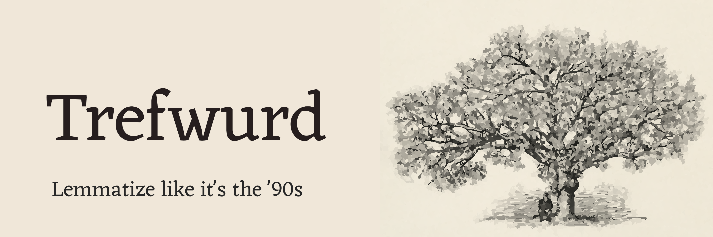

Status: incomplete. Don't use yet.

You probably don't need a lemmatizer, but if you do, *trefwurd*'s got you covered.

Trefwurd is..

- fast (20k unique tokens/s)
- lightweight (pure Python, zero dependencies)
- low memory footprint
- robust
- overridable, with custom exception lists
- easy to train

## What's a lemmatizer?


## Installing

Trefwurd is compatible with **Python 3.6** and up, because type annotations and 
f-strings are beautiful.

```bash
$ pip install trefwurd
```

Download pretrained lemmatization models.

```bash
$ python3 -m trefwurd download {iso-lang-code}
```

## Simple example

```Python
import trefwurd
lemmatizer = trefwurd.load("nl")
lemmatizer.lemmatize("honden", "NOUN")
```

```Python
lemmatizer.lemmatize([("honden", "NOUN"), ("eten", "VERB"), ("alles", "NOUN"))
```


```Python
lemmatizer.lemmatize(["honden", "eten", "alles"])
```

## Documentation

TODO: make table.

## Contributing

### Tests

TODO: Um... Add tests.

